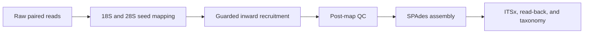

# ITSME

**Iterative Targeted Sequence Mining and Extension**

ITSME is a targeted short-read assembly pipeline for recovering eukaryotic nuclear rDNA loci:

```text
18S (SSU) ──→ ITS1 ──→ 5.8S ──→ ITS2 ──→ 28S (LSU)
```

It maps genomic reads to 18S and 28S seed databases, recruits their mates, performs guarded inward extension across the ITS region, quality-filters the recruited subset, and assembles it with SPAdes. Final contigs are oriented and annotated with ITSx, validated by competitive read mapping, and classified against local NCBI SSU, ITS, and LSU databases.



By default, ITSME performs one conservative extension round from the inward-facing ends of 18S and 28S. Use `-R 0` to disable extension or `--outward` to recruit from the complete seed-hit frontier. Excessive recruitment growth is rejected before assembly.

## Requirements

ITSME uses Bash, Bowtie2, Samtools, SPAdes, BLAST+, Python 3, Trimmomatic, FLASH2, ITSx, and BBMap/BBDuk.

Create and activate the software environment:

```bash
mamba create -n itsme \
    -c conda-forge \
    -c bioconda \
    bowtie2 samtools spades blast itsx bbmap trimmomatic flash2 pigz seqkit \
    --yes

mamba activate itsme
```

Supply one database root with `--db-dir`. It should contain:

```text
itsme_db/
├── silva-euk-18s-id95.fasta
├── silva-euk-28s-id98.fasta
├── NCBI_rRNA_BLAST/
│   ├── SSU_eukaryote_rRNA.*
│   ├── ITS_eukaryote_sequences.*
│   ├── LSU_eukaryote_rRNA.*
│   └── taxdb.*
└── taxdump/
    ├── nodes.dmp
    ├── names.dmp
    └── merged.dmp
```

Create this directory automatically in the current directory:

```bash
chmod +x setup_db.sh
./setup_db.sh
```

Or choose a location:

```bash
./setup_db.sh --db-dir /home/ark/databases/itsme_db
```

## Quick start

```bash
chmod +x itsme.sh itsme_controller.sh setup_db.sh
```

Run one paired library:

```bash
./itsme.sh \
    -1 sample_R1_001.fastq.gz \
    -2 sample_R2_001.fastq.gz \
    --db-dir /home/ark/databases/itsme_db \
    -o itsme_sample
```

Run every paired library in a directory:

```bash
./itsme_controller.sh \
    -i /path/to/fastqs \
    -o /path/to/itsme_results \
    --db-dir /home/ark/databases/itsme_db
```

The controller pairs `_R1` and `_R2` files, creates one result directory per library, and writes `batch_status.tsv` and `batch_master_summary.csv`. ITSME options such as `--db-dir`, `-t`, `-m`, and `-R` can be provided directly to the controller and are passed to every library run.

Resume a batch with `--resume`:

```bash
./itsme_controller.sh \
    -i /path/to/fastqs \
    -o /path/to/itsme_results \
    --resume \
    --db-dir /home/ark/databases/itsme_db
```

Primary results include `master_summary.csv`, `final/oriented_dual_anchor_contigs.fasta`, `final/complete_ITS.fasta`, and the separate ITS-region FASTA files.

Run `./itsme.sh --help` or `./itsme_controller.sh --help` for all options.
